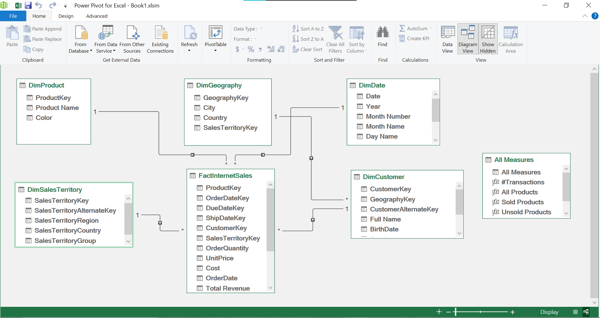

# 📊 Adventure Works Sales & Profit Analysis

## 📌 Project Overview

This project analyzes **four years of transactional sales data** for *Adventure Works* with a strong focus on **profit performance and time-based trends**. Using Microsoft Excel as the primary analytics tool, the project transforms raw transactional data into **interactive, decision-oriented dashboards** that highlight patterns across **time, products, and customer locations (countries)**.

The goal of the analysis is not just visualization, but to uncover **actionable insights** that support business and strategic decision-making.

---

## 🎯 Business Objectives

* Evaluate **profit trends over time**
* Identify **seasonality and growth patterns**
* Analyze **product-level and regional profitability**
* Support data-driven decisions through clear, interactive visuals

---

## ⏱ Time Analysis Dashboard

The **Time Analysis Dashboard** serves as the primary entry point into the analysis. It focuses on understanding **how business performance evolves over time** and where profit is concentrated across different periods.

### Key Features & Insights

* Year-over-year trends for:

  * Revenue
  * Profit
  * Cost of Goods Sold (COGS)
  * Transactions
* Dynamic filtering by:

  * Year
  * Month
  * Country
* Monthly profit trends highlighting peak performance periods
* **Quarterly profit contribution**, with Q4 contributing the largest share
* **Weekday vs weekend analysis**, showing weekdays generate the majority of profit
* Identification of high-performing months and weekdays

### Business Value

* Reveals strong **seasonality**, especially toward the end of the year
* Helps optimize planning for inventory, staffing, and promotions
* Highlights when the business generates the most value, not just how much

### 📸 Time Analysis Dashboard Preview

---

## 📊 Detailed Performance Dashboard

The **Detailed Dashboard** drills deeper into **what drives profitability**, focusing on products, customers, pricing, and geography.

### Key Features & Insights

* **Top 5 most profitable products**, contributing roughly 25% of total profit
* Profit analysis by **product attributes** (e.g., color)
* **Pricing analysis**, comparing higher-priced vs lower-priced products
* Profit contribution by:

  * Customer age group
  * Gender
* Geographic profit distribution using an **interactive map**
* Inventory overview:

  * Available products
  * Sold vs unsold products

### Business Value

* Identifies high-impact products and customer segments
* Highlights concentration risk in profitability
* Supports pricing, product, and regional strategy decisions

### 📸 Detailed Dashboard Preview

---

## 🧩 Data Model (ER Diagram)

The analysis is built on a **simplified star-schema design** to ensure accurate aggregation and flexible filtering.

### Model Structure

* **Fact Table**

  * Sales transactions (quantity, revenue, cost, profit)
* **Dimension Tables**

  * Products
  * Customers
  * Dates
  * Geography (Country)

This structure supports all time-based, product-level, and regional analysis across dashboards.

### 📸 ER Diagram

---

## 🛠 Tools & Technologies

* **Microsoft Excel** (end-to-end)

  * Data cleaning and transformation using **Power Query (M code)**
  * KPI calculations using **DAX**
  * Pivot tables and Excel data modeling
* **Excel Visualizations**

  * Interactive dashboards
  * Slicers and filters
  * Map visual for geographic analysis
* **Analytical Techniques**

  * Time series analysis
  * Profitability analysis
  * Contribution and trend analysis

---

## 🧮 Key Metrics & Logic

* **Revenue** = Total sales value
* **Profit** = Revenue − Cost of Goods Sold (COGS)
* **Profit Margin** = Profit ÷ Revenue
* **Year-over-Year Growth (%)** =
  (Current Year − Previous Year) ÷ Previous Year
* **Contribution (%)** =
  Segment Profit ÷ Total Profit

All metrics dynamically respond to filters applied across dashboards.

---

## 🔍 Key Insights & Findings

* Profit growth is heavily concentrated in the most recent years
* **Q4 contributes the highest share of annual profit**, indicating strong seasonality
* Weekdays generate over 70% of total profit
* A small subset of products drives a disproportionate share of profitability
* Higher-priced products contribute significantly more profit than lower-priced ones
* Profitability varies significantly by country

---

## 💡 Business Recommendations

* Leverage Q4 seasonality with targeted marketing and inventory planning
* Focus on high-margin, high-performing products
* Optimize weekday operations where profit is highest
* Review underperforming products and regions for optimization opportunities
* Use time-based insights to improve forecasting and planning

---

## 📂 Project Files

* `Book1.xlsm` – Data preparation, modeling, DAX, and Power Query (M code)
* Dashboard screenshots (stored in `/images`)

  * Time Analysis Dashboard
  * Detailed Performance Dashboard
* ER Diagram

---

